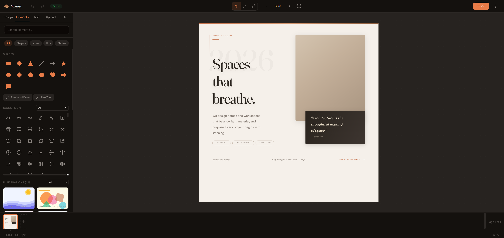

<p align="center">
  
</p>

<h1 align="center">Monet</h1>

<p align="center">
  <a href="LICENSE"></a>
  <a href="https://github.com/pj-casey/Monet"></a>
</p>

**The free, open-source design tool for everyone.**

Create professional social media graphics, presentations, posters, business cards, and more — no design skills required. No account needed. No paywall. No catch.

**[Try it live →](https://pj-casey.github.io/Monet/)** · [Self-Host Guide](SELF-HOSTING.md) · [Contribute Templates](docs/TEMPLATE_GUIDE.md)

---

<p align="center">
  
</p>

## Why Monet?

Design tools shouldn't cost $120/year for features that should be free. Monet gives you what others put behind a paywall:

| Feature | Canva Free | Canva Pro ($120/yr) | **Monet (Free)** |
|---|---|---|---|
| Templates | Limited | 610,000+ | **50+ built-in** |
| Brand Kit | No | Yes | **Unlimited** |
| Background Remover | No | Yes | **Runs in-browser** |
| Magic Resize | No | Yes | **+ Batch Export** |
| Custom Fonts | No | Yes | **1,900+ Google Fonts** |
| Real-time Collaboration | No | Yes | **Yes** |
| Self-hostable | No | No | **Yes** |
| AI Design Assistant | No | Paid add-on | **BYOK** |
| Your data stays yours | No | No | **Always** |

## Features

**Core Editor** — Shapes, text, images, freehand drawing, pen tool for custom vector paths. 10 image filters. Blend modes. Clipping masks. Rulers. Precise X/Y/W/H positioning. Undo/redo everything.

**1,900+ Fonts** — The full Google Fonts library, searchable by category, with lazy-loaded previews. Font pairing suggestions built in.

**1,900+ Icons** — The complete Lucide icon set, searchable with categories. Insert as editable, recolorable SVGs.

**Stock Photos** — Search and insert free photos from Unsplash and Pexels without leaving the editor.

**Templates** — 50+ built-in templates across 16 categories. Save your own. Browse the community marketplace. Or describe what you want and let AI generate one.

**Brand Kit** — Save your colors, fonts, and logos. Create multiple kits for different clients. Brand colors appear in every color picker automatically.

**Magic Resize** — Resize any design to a different format (Instagram → Story → Twitter → LinkedIn) with one click. Batch export all sizes as a ZIP.

**Background Remover** — AI-powered, runs entirely in your browser. Your images never leave your computer.

**AI Design Assistant (BYOK)** — Bring your own Anthropic API key. Chat with Claude about your design. Get feedback, generate copy, translate text, modify layouts with natural language, extract brand colors from images, generate design variations.

**Real-time Collaboration** — Multiple users editing the same design simultaneously with cursor presence, comments, and permissions.

**Export Anywhere** — PNG, JPG, SVG, PDF. At 1x, 2x, or 3x resolution. Download instantly — no watermark, no "Made with Monet" branding.

**Plugin System** — Built-in QR code generator, Lorem Ipsum, and chart widgets. Extensible API for building your own.

**Works Offline** — Service worker caches everything. Start designing on a plane.

**Self-Hostable** — `docker compose up` and you have your own instance with auth, cloud sync, and sharing.

## Quick Start

```bash
git clone https://github.com/pj-casey/Monet.git
cd Monet
pnpm install
pnpm dev
```

Open [http://localhost:5173](http://localhost:5173). That's it.

### Optional: Stock Photos

Create `apps/web/.env`:

```
VITE_UNSPLASH_ACCESS_KEY=your_key_here
VITE_PEXELS_API_KEY=your_key_here
```

Free API keys: [Unsplash Developers](https://unsplash.com/developers) · [Pexels API](https://www.pexels.com/api/)

### Optional: AI Features

Connect your Anthropic API key directly in the editor — click the AI tab and follow the setup. Your key stays in your browser's local storage and is only sent to `api.anthropic.com`.

### Optional: Backend + Auth

```bash
pnpm dev:all    # Starts frontend + API server
```

See [SELF-HOSTING.md](SELF-HOSTING.md) for Docker deployment, Nginx config, and OAuth setup.

## Self-Hosting

```bash
docker compose up -d
```

One command. Frontend + API + SQLite. Runs on a $5/month VPS or a Raspberry Pi.

Full guide: [SELF-HOSTING.md](SELF-HOSTING.md)

## Tech Stack

| Layer | Technology |
|---|---|
| Canvas | [Fabric.js](http://fabricjs.com/) v7 |
| Frontend | React 18 + TypeScript + [Vite](https://vitejs.dev/) |
| Styling | [Tailwind CSS](https://tailwindcss.com/) v4 + custom design tokens (OKLCH) |
| State | [Zustand](https://zustand-demo.pmnd.rs/) |
| Backend | [Hono](https://hono.dev/) + SQLite via sql.js |
| Collaboration | Socket.io + [Yjs](https://yjs.dev/) CRDT |
| AI (client-side) | [Transformers.js](https://huggingface.co/docs/transformers.js) for background removal |
| AI (BYOK) | [Anthropic API](https://docs.anthropic.com/) for design assistant |
| Monorepo | pnpm workspaces |

## Project Structure

```
monet/
├── apps/web/              # React frontend (the editor)
├── apps/api/              # Optional backend (auth, sync, sharing)
├── packages/canvas-engine/ # Fabric.js wrapper (all canvas logic)
├── packages/templates/     # 50+ built-in template definitions
├── packages/shared/        # Shared types and utilities
└── docs/                   # Architecture, roadmap, guides
```

## Contributing

Monet welcomes contributions of all kinds. You don't need to write code to help.

**Designers** — [Create and submit templates](docs/TEMPLATE_GUIDE.md). No code required — templates are JSON with shapes and text.

**Translators** — Help make Monet accessible worldwide. Translation files are in `apps/web/src/i18n/`.

**Bug Reports** — Found something broken? [Open an issue](../../issues).

**Developers** — See [CONTRIBUTING.md](CONTRIBUTING.md) for setup, architecture, and coding guidelines.

**Documentation** — Improve guides, write tutorials, or fix typos.

See [CONTRIBUTING.md](CONTRIBUTING.md) for details.

## Keyboard Shortcuts

| Action | Shortcut |
|---|---|
| Undo / Redo | `Ctrl+Z` / `Ctrl+Y` |
| Copy / Paste / Duplicate | `Ctrl+C` / `Ctrl+V` / `Ctrl+D` |
| Copy / Paste Style | `Alt+Shift+C` / `Alt+Shift+V` |
| Delete | `Delete` / `Backspace` |
| Group / Ungroup | `Ctrl+G` / `Ctrl+Shift+G` |
| Save | `Ctrl+S` |
| Nudge / Big Nudge | `Arrow Keys` / `Shift+Arrow` |
| Alt+Drag | Duplicate and drag |
| Zoom In / Out | `Scroll Wheel` |
| Pan | `Space + Drag` |
| All Shortcuts | `?` |

## Support

If Monet saves you money, consider supporting development:

- [GitHub Sponsors](https://github.com/sponsors/pj-casey)
- [Open Collective](https://opencollective.com/claude-monet)

**Crypto:**

| Currency | Address |
|----------|---------|
| BTC | `bc1qws49067r4220vsf60ftg70fmnhmn2s24evnk8d` |
| ETH/EVM | `0x149F845Cb27b0cFA7AFaFC893e8620228b052731` |
| SOL | `8gRPQgjESd8cCWGtCnBv48FHeAAYaZVBdzzDqoJfN7Zr` |

## License

[AGPLv3](LICENSE) — Free to use, modify, and self-host. If you distribute a modified version, you must open-source your changes.

---

<sub>Built with [Claude](https://claude.ai) by [Anthropic](https://anthropic.com)</sub>
